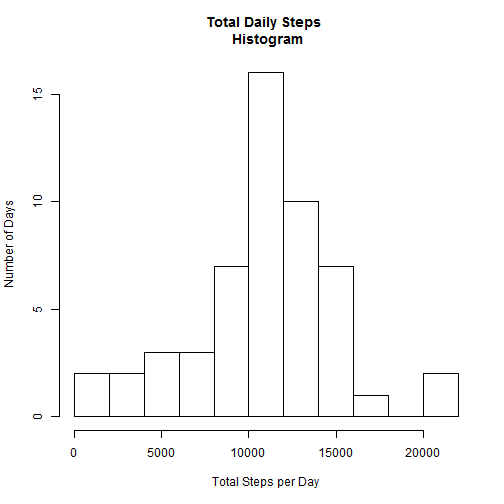
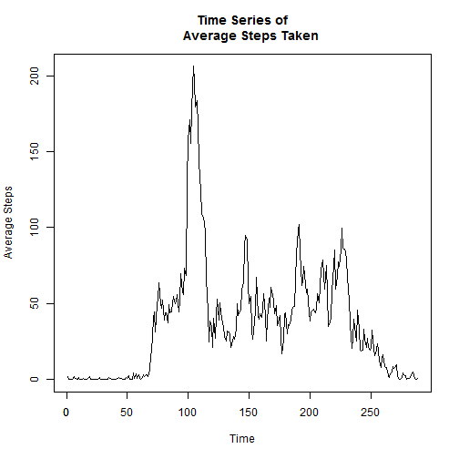
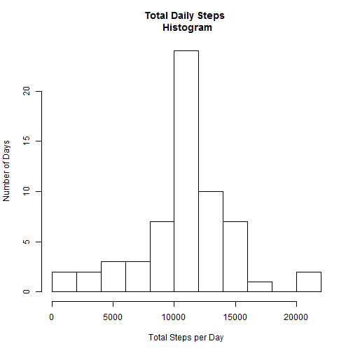
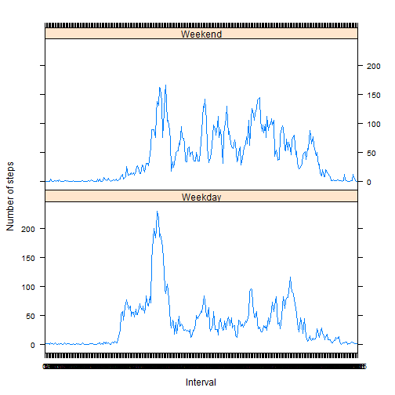

# Reproducible Research: Peer Assessment 1


## Loading and preprocessing the data
Load the required libraries.

```r
library(lattice)
library(sqldf)
library(plyr)
```

Read the data set from the current working directory.

```r
activityDF1 <- read.csv("activity.csv", 
                        stringsAsFactors = FALSE,
                        na.strings = "NA")
```
Preprocessing steps: 

- Convert date strings to Date objects

- Convert dates and intervals to factors

```r
activityDF1$date <- as.Date(activityDF1$date, 
                            format = "%Y-%m-%d")
activityDF1$date <- as.factor(activityDF1$date)
activityDF1$interval <- as.factor(activityDF1$interval)
activityDF <- activityDF1[complete.cases(activityDF1),]
head(activityDF)
```

```
##     steps       date interval
## 289     0 2012-10-02        0
## 290     0 2012-10-02        5
## 291     0 2012-10-02       10
## 292     0 2012-10-02       15
## 293     0 2012-10-02       20
## 294     0 2012-10-02       25
```


## What is mean total number of steps taken per day?

- Make a histogram of the total number of steps taken each day.


```r
dailySum <- aggregate(activityDF$steps,
                      by = list(activityDF$date), 
                      FUN = "sum", na.rm = TRUE)
colnames(dailySum) <- c("Date", "Total.Steps")

hist(dailySum$Total.Steps, xlab = "Total Steps per Day", 
     ylab = "Number of Days",
     main = "Total Daily Steps \n Histogram",
     breaks = 10)
```

 

- Calculate and report the mean and median total number of steps taken per day.


```r
stepMean <- mean(dailySum$Total.Steps)
stepMedian <- median(dailySum$Total.Steps)
print(paste(
        "The mean number of steps taken per day is ",stepMean))
```

```
## [1] "The mean number of steps taken per day is  10766.1886792453"
```

```r
print(paste(
        "The median number of steps taken per day is ",stepMedian))
```

```
## [1] "The median number of steps taken per day is  10765"
```

## What is the average daily activity pattern?
Make a time series plot (i.e. type = "l") of the 5-minute interval (x-axis) and the average number of steps taken, averaged across all days (y-axis).


```r
activityTS <- aggregate(activityDF$steps,
                        by = list(activityDF$interval),
                        FUN = "mean", na.rm = TRUE)
colnames(activityTS) <- c("Interval","Steps.Average")
activityTS <- as.ts(activityTS$Steps.Average)
firstTick <- as.integer(levels(activityDF$interval)[1])
lastTick <- as.integer(levels(activityDF$interval)[
                           length(levels(activityDF$interval))])
ticks <- seq(firstTick, lastTick, by=1000)

plot(activityTS, type="l", xlab = "Time",
     ylab = "Average Steps", main = "Time Series of
     Average Steps Taken")
axis(side=1,labels= as.character(ticks), at = ticks)
```

 

Which 5-minute interval, on average across all the days in the dataset, contains the maximum number of steps?


```r
maxInterval <- activityTS[which.max(activityTS)]
print(paste("The time interval with the maximum value is ", levels(activityDF$interval)[maxInterval]))
```

```
## [1] "The time interval with the maximum value is  1705"
```


## Imputing missing values
Calculate and report the total number of missing values in the dataset (i.e. the total number of rows with NAs)

```r
naCount <- nrow(activityDF1) - nrow(activityDF1[complete.cases(activityDF1),])
print(paste("Data set has ",naCount,"rows of missing values."))
```

```
## [1] "Data set has  2304 rows of missing values."
```
Devise a strategy for filling in all of the missing values in the dataset. The strategy does not need to be sophisticated. For example, you could use the mean/median for that day, or the mean for that 5-minute interval, etc.

- Strategy selected was to use the mean value for the time
interval across all days.

Create a new dataset that is equal to the original dataset but with the missing data filled in.

```r
# Compute the mean across the intervals.
activityIntervalAvg <- aggregate(activityDF$steps,
                        by = list(activityDF$interval),
                        FUN = "mean", na.rm = TRUE)
colnames(activityIntervalAvg) <- c("interval", "AverageSteps")

# Join the averages to the original data frame.
newDF <- join(activityDF1,activityIntervalAvg)
```

```
## Joining by: interval
```

```r
# For any row that has an NA value, 
# replace it with the average.
naIndexes <- which(is.na(newDF$steps))
newDF[naIndexes,"steps"] <- newDF[naIndexes,"AverageSteps"]
head(newDF)
```

```
##     steps       date interval AverageSteps
## 1 1.71698 2012-10-01        0      1.71698
## 2 0.33962 2012-10-01        5      0.33962
## 3 0.13208 2012-10-01       10      0.13208
## 4 0.15094 2012-10-01       15      0.15094
## 5 0.07547 2012-10-01       20      0.07547
## 6 2.09434 2012-10-01       25      2.09434
```

Make a histogram of the total number of steps taken each day.


```r
dailySum2 <- aggregate(newDF$steps,
                      by = list(newDF$date), 
                      FUN = "sum", na.rm = TRUE)
colnames(dailySum2) <- c("Date", "Total.Steps")

hist(dailySum2$Total.Steps, xlab = "Total Steps per Day", 
     ylab = "Number of Days",
     main = "Total Daily Steps \n Histogram",
     breaks = 10)
```

 

Calculate and report the mean and median total number of steps taken per day. 


```r
stepMean2 <- mean(dailySum2$Total.Steps)
stepMedian2 <- median(dailySum2$Total.Steps)
print(paste("The mean with NAs replaced is ",stepMean2,"."))
```

```
## [1] "The mean with NAs replaced is  10766.1886792453 ."
```

```r
print(paste("The median with NAs replaced is ",stepMedian2,"."))
```

```
## [1] "The median with NAs replaced is  10766.1886792453 ."
```
Do these values differ from the estimates from the first part of the assignment? What is the impact of imputing missing data on the estimates of the total daily number of steps?

Answer: The mean values are the same, which is logical, since
the mean is used to replace the NAs.  The median value is only
nominally larger, probably due to the decimal part of the mean
value being used, in contrast to the strictly integer nature
of the original step data.

## Are there differences in activity patterns between weekdays and weekends?

Create a new factor variable in the dataset with two levels - "weekday" and "weekend" indicating whether a given date is a weekday or weekend day.


```r
# First, convert date factors back to dates
newDF$date <- as.Date(newDF$date, format = "%Y-%m-%d")
dayFactors <- as.factor(ifelse(weekdays(newDF$date) %in% c("Saturday","Sunday"), "Weekend", "Weekday"))
newDF <- cbind(newDF, dayFactors)
head(newDF)
```

```
##     steps       date interval AverageSteps dayFactors
## 1 1.71698 2012-10-01        0      1.71698    Weekday
## 2 0.33962 2012-10-01        5      0.33962    Weekday
## 3 0.13208 2012-10-01       10      0.13208    Weekday
## 4 0.15094 2012-10-01       15      0.15094    Weekday
## 5 0.07547 2012-10-01       20      0.07547    Weekday
## 6 2.09434 2012-10-01       25      2.09434    Weekday
```
Make a panel plot containing a time series plot (i.e. type = "l") of the 5-minute interval (x-axis) and the average number of steps taken, averaged across all weekday days or weekend days (y-axis). 

```r
activityTS2 <- aggregate(newDF$steps,
                        by = list(newDF$interval,
                                  newDF$dayFactors),
                        FUN = "mean", na.rm = TRUE)
colnames(activityTS2) <- c("Interval","DayClass","Average")

xyplot(activityTS2$Average ~ activityTS2$Interval |
               activityTS2$DayClass, layout = c(1,2),
       type = "l",xlab = "Interval", 
       ylab = "Number of steps")
```

 

